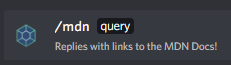
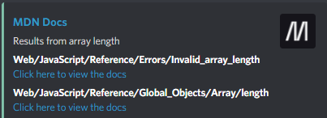

<p align="center">

</p>

<h1 align="center">Codebox</h1>

<p align="center"> Simple discord bot for begginers developers to search through MDN Docs.
</p>

---

## 📝 Table of Contents

- [About](#about)
- [Getting Started](#getting_started)
- [Prerequisites](#prerequisites)
- [Installing](#install)
- [Usage](#usage)
- [Techs](#built_using)
- [Authors](#authors)

## 🧐 About <a name = "about"></a>

Simple discord bot for begginers developers to search through MDN Docs.
The idea behing this project initialized from my friend, who is starting on the tech world and wanted a discord bot to get mdn links faster. 

## 🏁 Getting Started <a name = "getting_started"></a>

These instructions will get you a copy of the project up and running on your local machine for development and testing purposes. See [deployment](#deployment) for notes on how to deploy the project on a live system.

### Prerequisites <a name = "prerequisites"></a>

```
Node.js version >= 16.6.0
```

### Installing <a name = "install"></a>

1. Install all dependencies

```sh
yarn install
```

2. Create `.env` file to configurate `CLIENTID`, `GUILDID`, `TOKEN`

```sh
TOKEN = <DISCORD_BOT_TOKEN>
GUILDID = <GUILD_ID>
CLIENTID = <CLIENT_ID>
```

3. Run `yarn setup` to setup all commands to the discord server

4. Run `yarn start` If u want to run as a production, or `yarn dev` If u want to run as a development.

## 🎈 Usage <a name="usage"></a>

1. On your discord server, type `/mdn` and will autocomplete.

</a>

2. Type a query and will show up the results.

</a>

## ⛏️ Built Using <a name = "built_using"></a>

- [Node.js](https://nodejs.org/en/) - Javascript on backend
- [Discord.js](https://discord.js.org/#/) - Node.js Library


## ✍️ Authors <a name = "authors"></a>

- [@Yuki2dev](https://github.com/Yuki2dev)
